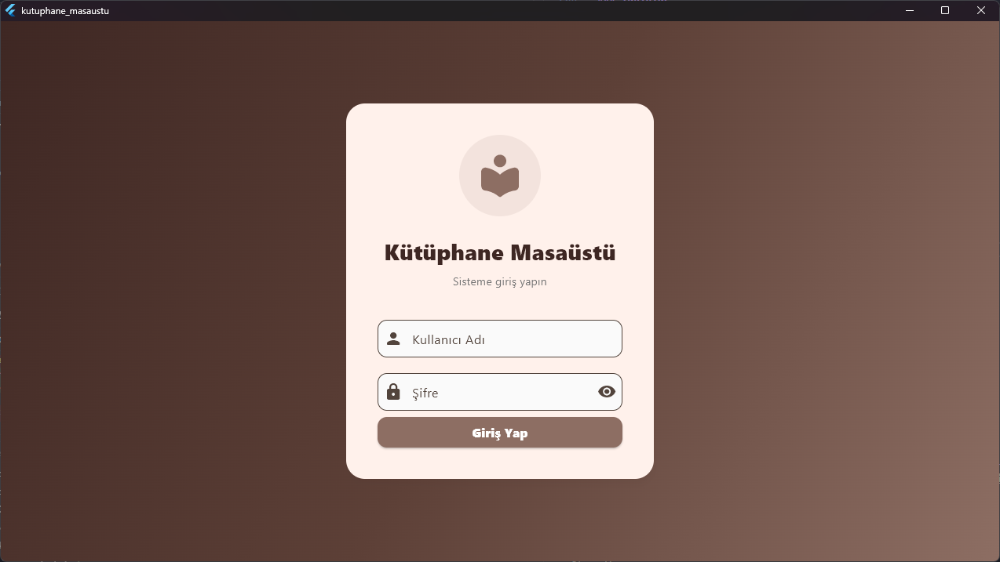
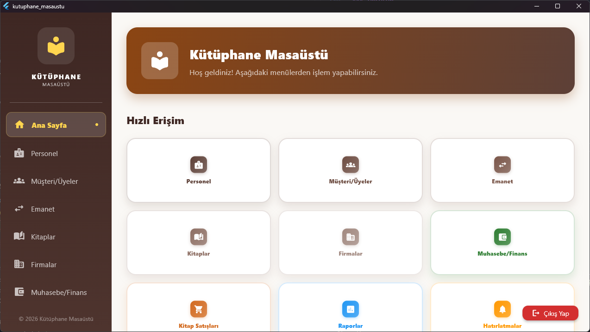
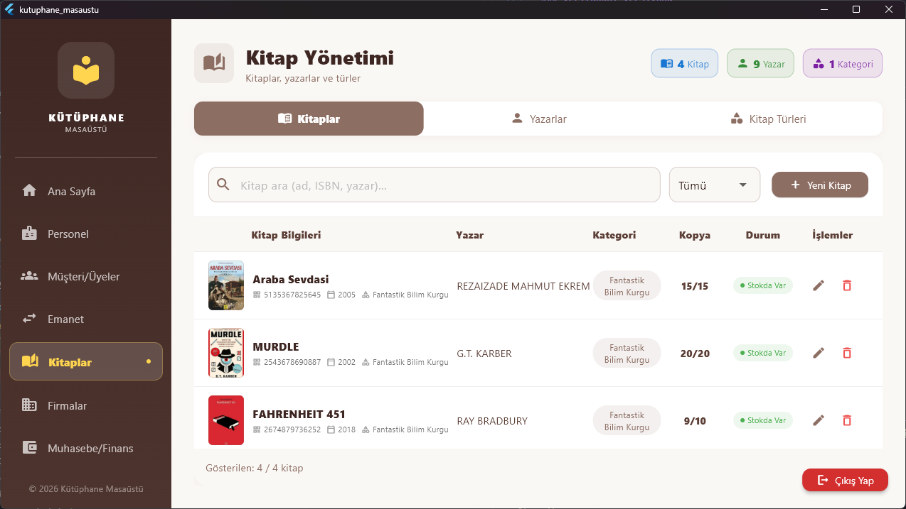
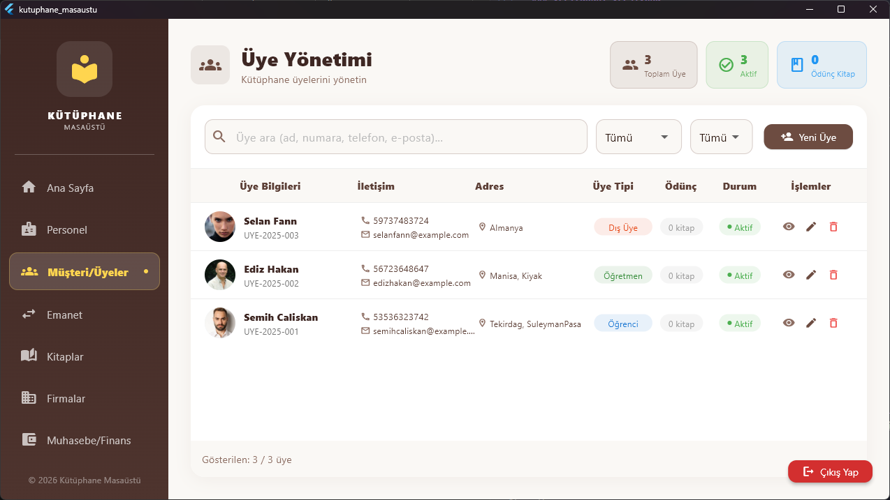
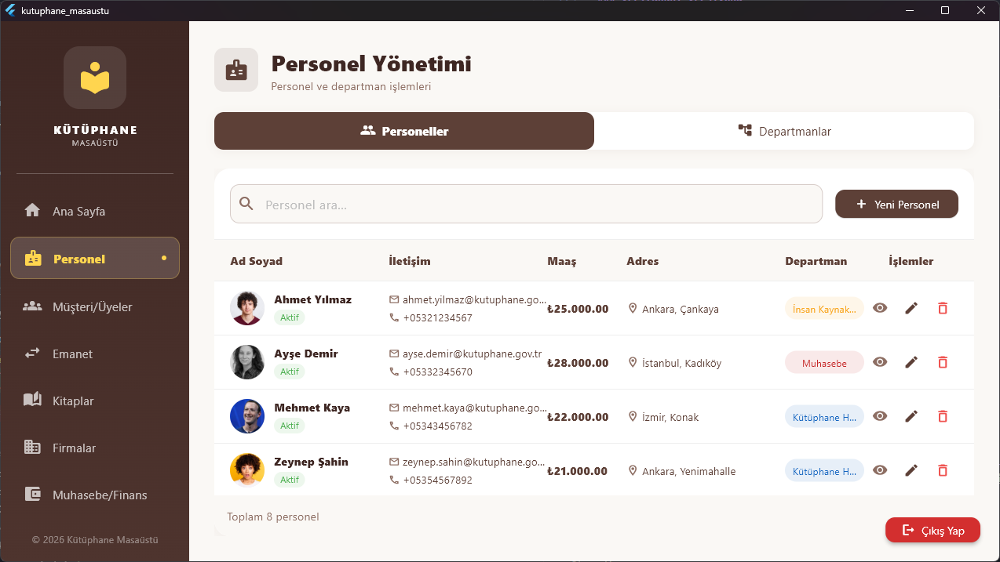
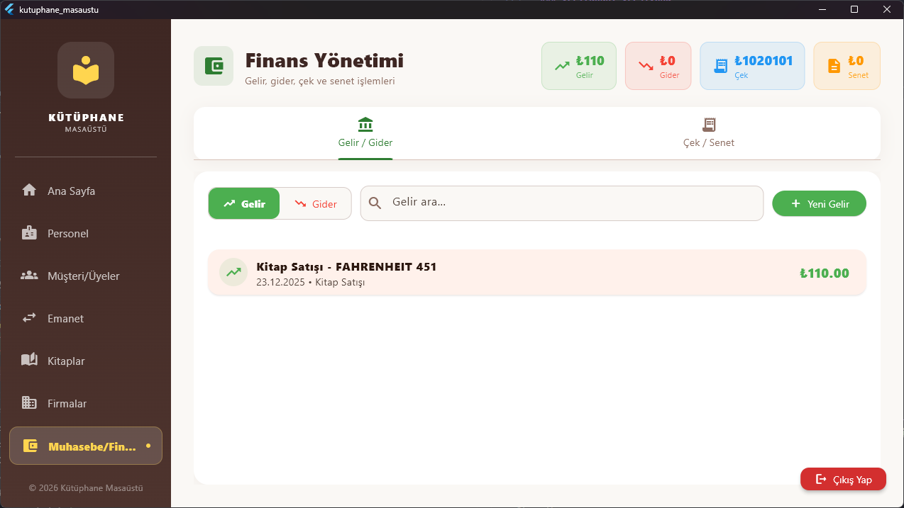
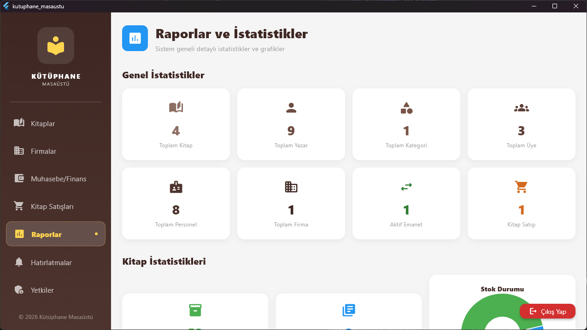

# 📚 Kütüphane Yönetim Sistemi (Desktop Uygulaması)

Modern ve kapsamlı bir kütüphane yönetim sistemi. Flutter framework'ü kullanılarak geliştirilmiş masaüstü uygulaması.

**Repository:** [https://github.com/bukkitcraft/kutuphane_masaustu](https://github.com/bukkitcraft/kutuphane_masaustu)

## 📋 İçindekiler

- [Proje Hakkında](#proje-hakkında)
- [Özellikler](#özellikler)
- [Teknolojiler](#teknolojiler)
- [Kurulum](#kurulum)
- [Kullanım](#kullanım)
- [Proje Yapısı](#proje-yapısı)
- [Veritabanı](#veritabanı)
- [Ekran Görüntüleri](#ekran-görüntüleri)
- [Geliştirici Notları](#geliştirici-notları)
- [Lisans](#lisans)
- [Katkıda Bulunanlar](#katkıda-bulunanlar)
- [İletişim](#iletişim)

<a id="proje-hakkında"></a>
## 🎯 Proje Hakkında

Bu proje, kütüphanelerin günlük işlemlerini dijitalleştirmek ve yönetmek için geliştirilmiş kapsamlı bir masaüstü uygulamasıdır. Sistem, kitap yönetimi, üye takibi, personel yönetimi, finansal işlemler ve raporlama gibi temel kütüphane işlemlerini tek bir platformda toplar.

### Proje Amacı

- Kütüphane işlemlerini dijitalleştirmek
- Veri yönetimini kolaylaştırmak
- Raporlama ve analiz imkanı sunmak
- Kullanıcı yetkilendirme sistemi ile güvenli erişim sağlamak

<a id="özellikler"></a>
## ✨ Özellikler

### 📖 Kitap Yönetimi
- Kitap ekleme, düzenleme ve silme
- ISBN, yazar, kategori ve yayınevi bilgileri
- Kitap kopya takibi (toplam, mevcut, ödünç verilen)
- Kitap konum bilgisi
- Kitap satış işlemleri

### 👥 Üye Yönetimi
- Üye kayıt ve güncelleme
- Üye numarası takibi
- TC Kimlik No ve iletişim bilgileri
- Aktif/pasif üye durumu

### 👨‍💼 Personel Yönetimi
- Personel bilgileri yönetimi
- Departman bazlı organizasyon
- Maaş ve hesap bilgileri takibi
- IBAN ve hesap numarası yönetimi

### 📦 Emanet İşlemleri
- Kitap ödünç verme/alma
- Emanet takibi ve iade işlemleri
- Vade takibi ve gecikme uyarıları
- Emanet geçmişi

### 💰 Finansal Yönetim
- Gelir ve gider takibi
- Çek yönetimi
- Senet (promissory note) takibi
- Finansal raporlama

### 🏢 Şirket Yönetimi
- Yayınevi ve şirket bilgileri
- İletişim ve adres bilgileri

### 📊 Raporlama ve Analiz
- İstatistiksel raporlar
- Grafik ve görselleştirmeler
- Kitap, üye, personel istatistikleri
- Finansal özet raporlar

### 🔔 Hatırlatma Sistemi
- Görev ve hatırlatma oluşturma
- Tarih bazlı hatırlatmalar
- Tamamlanma durumu takibi

### 🔐 Kullanıcı Yetkilendirme
- Rol tabanlı erişim kontrolü
- Admin ve kullanıcı rolleri
- Menü bazlı yetkilendirme
- Güvenli şifre yönetimi (MD5 hash)

<a id="teknolojiler"></a>
## 🛠️ Teknolojiler

### Framework ve Dil
- **Flutter** - Cross-platform UI framework
- **Dart** - Programlama dili (SDK ^3.10.1)

### Veritabanı
- **SQLite** - Yerel veritabanı
- **sqflite** - SQLite Flutter paketi
- **sqflite_common_ffi** - Desktop platform desteği

### Diğer Kütüphaneler
- **path** - Dosya yolu yönetimi
- **file_picker** - Dosya seçme işlemleri
- **intl** - Uluslararasılaştırma ve tarih formatlama
- **crypto** - Şifreleme işlemleri
- **fl_chart** - Grafik ve görselleştirme
- **flutter_localizations** - Yerelleştirme desteği

<a id="kurulum"></a>
## 📦 Kurulum

### Gereksinimler

- Flutter SDK (3.10.1 veya üzeri)
- Dart SDK
- Windows/Linux/macOS işletim sistemi
- Git (opsiyonel)

### Adımlar

1. **Projeyi klonlayın veya indirin:**
   ```bash
   git clone https://github.com/bukkitcraft/kutuphane_masaustu.git
   cd kutuphane_masaustu
   ```

2. **Bağımlılıkları yükleyin:**
   ```bash
   flutter pub get
   ```

3. **Uygulamayı çalıştırın:**
   ```bash
   flutter run -d windows
   # veya
   flutter run -d linux
   # veya
   flutter run -d macos
   ```

4. **Release build oluşturun:**
   ```bash
   flutter build windows
   flutter build linux
   flutter build macos
   ```

<a id="kullanım"></a>
## 🚀 Kullanım

### İlk Giriş

Uygulama ilk açıldığında otomatik olarak bir admin kullanıcısı oluşturulur:

- **Kullanıcı Adı:** `admin`
- **Şifre:** `123`

> ⚠️ **Güvenlik Uyarısı:** Üretim ortamında mutlaka şifreyi değiştirin!

### Ana Özellikler

1. **Giriş Yapma:** Admin kullanıcısı ile sisteme giriş yapın
2. **Menü Navigasyonu:** Sol taraftaki menüden istediğiniz modüle erişin
3. **Veri Ekleme:** Her modülde "Ekle" butonu ile yeni kayıt oluşturun
4. **Veri Düzenleme:** Mevcut kayıtları düzenleyin veya silin
5. **Raporlama:** Raporlar ekranından istatistikleri görüntüleyin

### Veritabanı Konumu

Veritabanı dosyası otomatik olarak şu konumlarda oluşturulur:

- **Windows:** `%APPDATA%\KutuphaneMasaustu\kutuphane.db`
- **Linux:** `~/.kutuphane_masaustu/kutuphane.db`
- **macOS:** `~/Library/Application Support/KutuphaneMasaustu/kutuphane.db`

<a id="proje-yapısı"></a>
## 📁 Proje Yapısı

```
lib/
├── database/           # Veritabanı yönetimi
│   ├── database_helper_io.dart
│   ├── database_init.dart
│   └── ...
├── models/            # Veri modelleri
│   ├── book.dart
│   ├── member.dart
│   ├── personnel.dart
│   └── ...
├── screens/           # UI ekranları
│   ├── home_screen.dart
│   ├── login_screen.dart
│   ├── books_screen.dart
│   ├── members_screen.dart
│   └── ...
├── services/          # İş mantığı servisleri
│   ├── book_service.dart
│   ├── member_service.dart
│   └── ...
└── main.dart         # Ana uygulama dosyası
```

<a id="veritabanı"></a>
## 🗄️ Veritabanı

### Tablolar

- **books** - Kitap bilgileri
- **members** - Üye bilgileri
- **personnel** - Personel bilgileri
- **escrows** - Emanet işlemleri
- **authors** - Yazar bilgileri
- **book_categories** - Kitap kategorileri
- **departments** - Departmanlar
- **companies** - Şirket/Yayınevi bilgileri
- **income** - Gelir kayıtları
- **expense** - Gider kayıtları
- **checks** - Çek kayıtları
- **promissory_notes** - Senet kayıtları
- **book_sales** - Kitap satışları
- **users** - Kullanıcı hesapları
- **reminders** - Hatırlatmalar

### Veritabanı Versiyonu

Mevcut veritabanı versiyonu: **10**

<a id="ekran-görüntüleri"></a>
## 🎨 Ekran Görüntüleri

### Giriş Ekranı


### Ana Ekran


### Kitap Yönetimi


### Üye Yönetimi


### Personel Yönetimi


### Finans Yönetimi


### Emanet İşlemleri


### Raporlar


<a id="geliştirici-notları"></a>
## 👨‍💻 Geliştirici Notları

### Veritabanı Migration

Veritabanı şeması değiştiğinde, `database_helper_io.dart` dosyasındaki `_onUpgrade` metodunu güncelleyin ve versiyon numarasını artırın.

### Yeni Modül Ekleme

1. Model oluşturun (`lib/models/`)
2. Service oluşturun (`lib/services/`)
3. Screen oluşturun (`lib/screens/`)
4. Menüye ekleyin (`lib/screens/home_screen.dart`)

### Platform Desteği

Uygulama şu anda desktop platformlar için optimize edilmiştir:
- ✅ Windows
- ✅ Linux
- ✅ macOS
- ❌ Web (SQLite desteği yok)
- ❌ Mobile (test edilmemiş)

<a id="lisans"></a>
## 📝 Lisans

Bu proje eğitim amaçlı geliştirilmiştir. Tüm hakları saklıdır.

<a id="katkıda-bulunanlar"></a>
## 👥 Katkıda Bulunanlar

### Proje Geliştiricileri

- **Yunus Emre Günay** - [@bukkitcraft](https://github.com/bukkitcraft)
  - 📧 bukkitcraft@proton.me

- **Semih Çalışkan** - [@Scainest](https://github.com/Scainest)
  - 📧 semihcaliskan1907@gmail.com

**Geliştirme Tarihi:** 2025

<a id="iletişim"></a>
## 📞 İletişim

Sorularınız veya önerileriniz için yukarıdaki geliştiricilerle iletişime geçebilirsiniz.

---

**Not:** Bu proje bir okul projesi olarak geliştirilmiştir. Üretim ortamında kullanmadan önce güvenlik testlerinden geçirilmelidir.
