# 📚 Kütüphane Yönetim Sistemi (Desktop Uygulaması)

Modern ve kapsamlı bir kütüphane yönetim sistemi. Flutter framework'ü kullanılarak geliştirilmiş masaüstü uygulaması.

**Repository:** [https://github.com/bukkitcraft/kutuphane_masaustu](https://github.com/bukkitcraft/kutuphane_masaustu)

## İçindekiler

- [Proje Hakkında](#-proje-hakkında)
- [Ekran Görüntüleri](#-ekran-görüntüleri)
- [Özellikler](#-özellikler)
- [Teknolojiler](#-teknolojiler)
- [Kurulum](#-kurulum)
- [Debug Modu (Geliştirme)](#-debug-modu-geliştirme)
- [Build Alma (Yayınlama)](#-build-alma-yayınlama)
- [Kullanım](#-kullanım)
- [Proje Yapısı](#-proje-yapısı)
- [Veritabanı](#-veritabanı)
- [Geliştirici Notları](#-geliştirici-notları)
- [Katkıda Bulunanlar](#-katkıda-bulunanlar)

---

## 🎯 Proje Hakkında

Bu proje, kütüphanelerin günlük işlemlerini dijitalleştirmek ve yönetmek için geliştirilmiş kapsamlı bir masaüstü uygulamasıdır. Sistem, kitap yönetimi, üye takibi, personel yönetimi, finansal işlemler ve raporlama gibi temel kütüphane işlemlerini tek bir platformda toplar.

### Proje Amacı

- Kütüphane işlemlerini dijitalleştirmek
- Veri yönetimini kolaylaştırmak
- Raporlama ve analiz imkanı sunmak
- Kullanıcı yetkilendirme sistemi ile güvenli erişim sağlamak

---

## 📸 Ekran Görüntüleri

### Giriş Ekranı
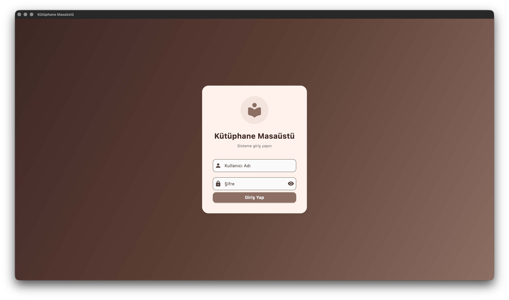

### Ana Sayfa
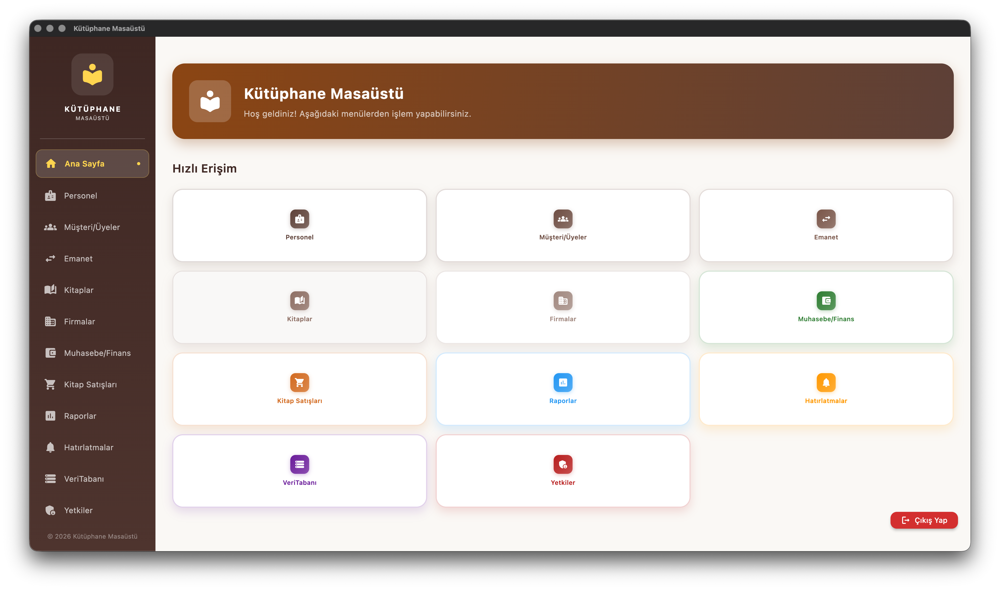

### Kitap Yönetimi
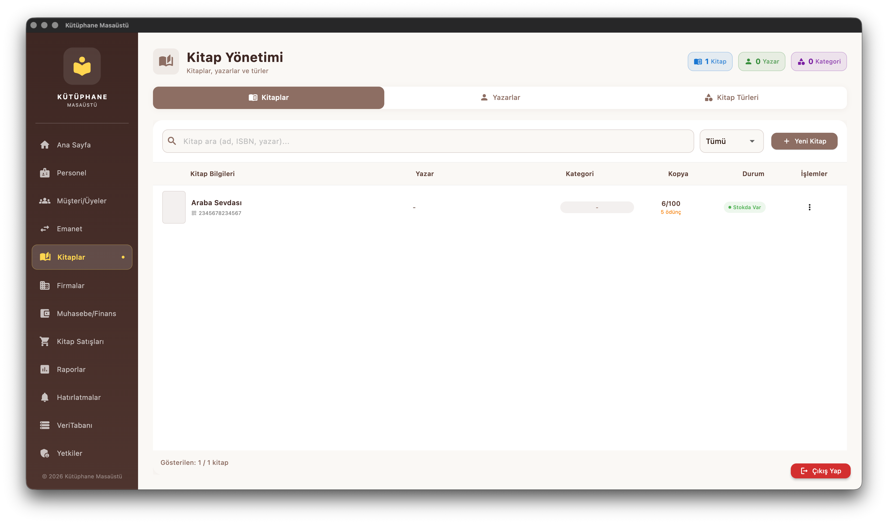

### Üye Yönetimi
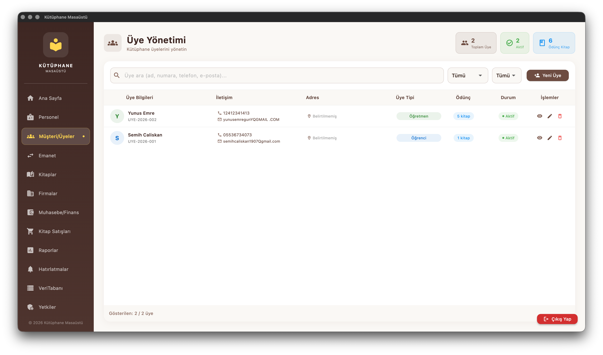

### Personel Yönetimi
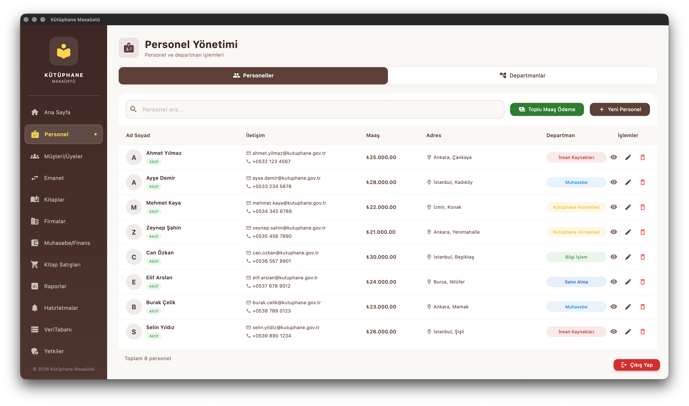

### Emanet İşlemleri
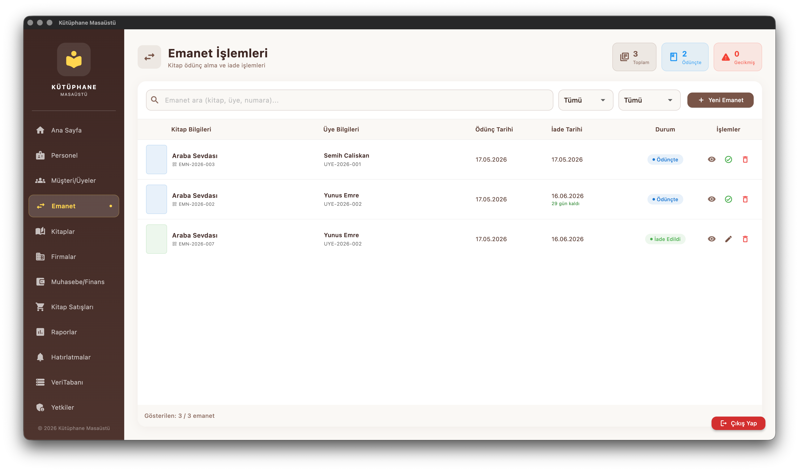

### Muhasebe / Finans
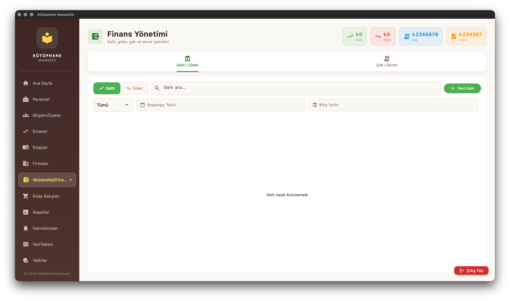

### Kitap Satışları
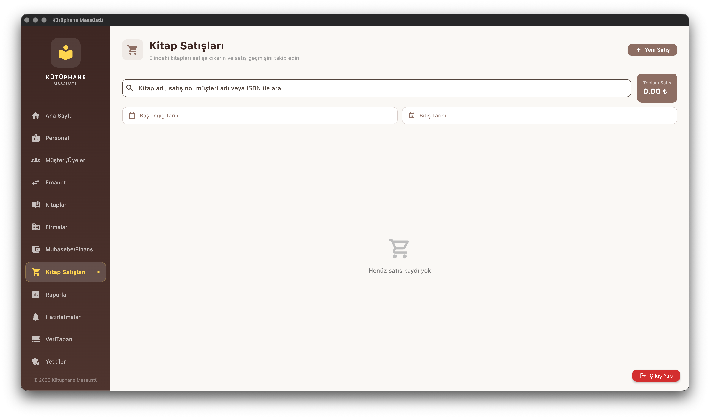

### Raporlar
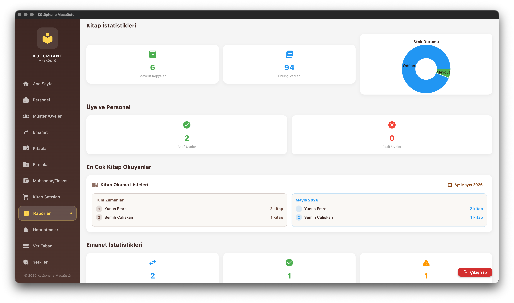

### Hatırlatmalar
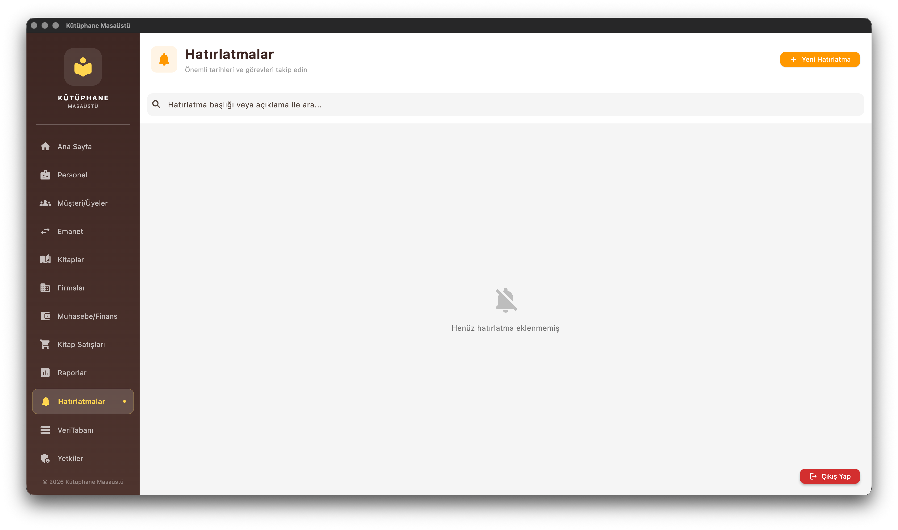

### Firmalar
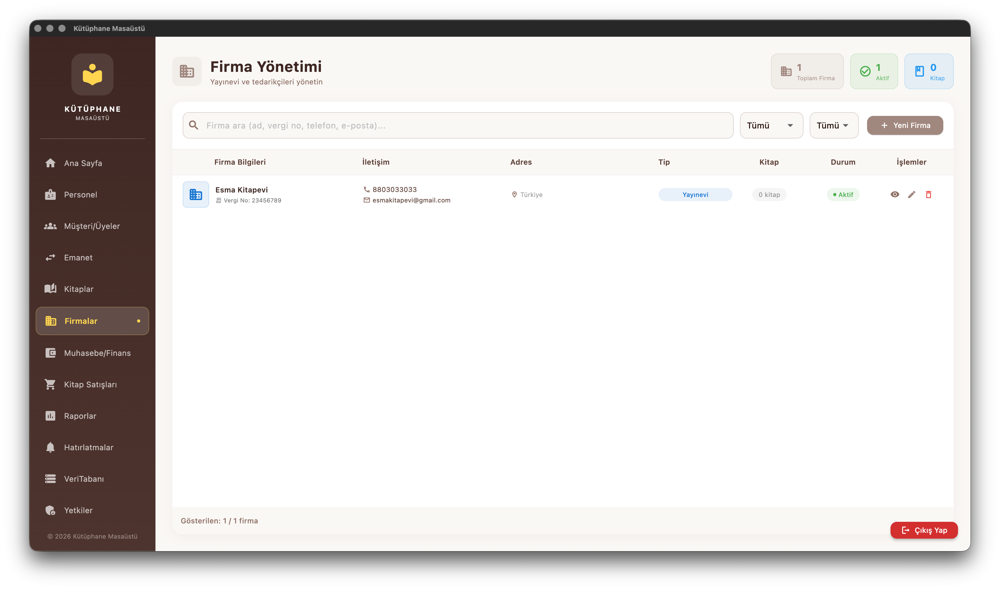

### Kullanıcı Yetkileri
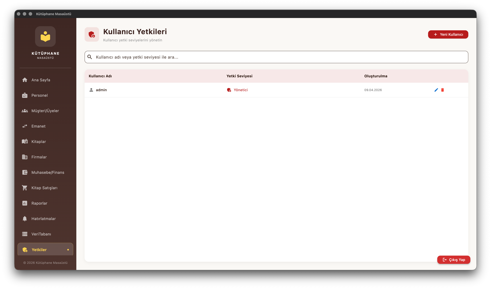

### Veritabanı
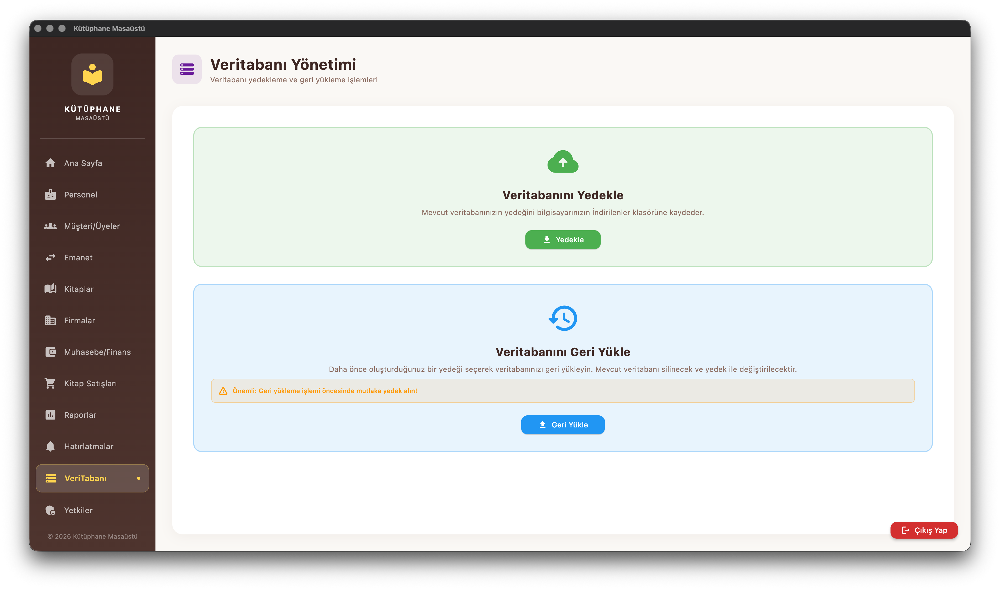

---

## ✨ Özellikler

### 📖 Kitap Yönetimi
- Kitap ekleme, düzenleme ve silme
- ISBN, yazar, kategori ve yayınevi bilgileri
- Kitap kopya takibi (toplam, mevcut, ödünç verilen)
- Kitap konum bilgisi
- Yazar ve kategori yönetimi

### 👥 Üye Yönetimi
- Üye kayıt ve güncelleme
- Üye numarası takibi
- TC Kimlik No ve iletişim bilgileri
- Aktif/pasif üye durumu

### 👨‍💼 Personel Yönetimi
- Personel bilgileri yönetimi
- Departman bazlı organizasyon
- Maaş ve hesap bilgileri takibi
- IBAN ve hesap numarası yönetimi
- Toplu maaş ödeme sistemi

### 📦 Emanet İşlemleri
- Kitap ödünç verme/alma
- Emanet takibi ve iade işlemleri
- Vade takibi ve gecikme uyarıları
- Emanet geçmişi
- Otomatik hatırlatma sistemi (3 gün kala)

### 💰 Finansal Yönetim
- Gelir ve gider takibi
- Çek yönetimi (otomatik numara üretimi)
- Senet (promissory note) takibi
- Finansal raporlama
- Günlük harcama takibi
- Kategori ve tarih bazlı filtreleme

### 🏢 Şirket Yönetimi
- Yayınevi ve şirket bilgileri
- İletişim ve adres bilgileri
- Şirket bazlı ödeme takibi

### 📊 Raporlama ve Analiz
- İstatistiksel raporlar
- Grafik ve görselleştirmeler
- Kitap, üye, personel istatistikleri
- Finansal özet raporlar

### 🔔 Hatırlatma Sistemi
- Görev ve hatırlatma oluşturma
- Tarih bazlı hatırlatmalar
- Tamamlanma durumu takibi
- Otomatik kitap iade hatırlatmaları

### 🛒 Kitap Satışları
- Kitap satış kaydı oluşturma
- Üye veya misafir satışı
- Satış geçmişi ve filtreleme (tarih aralığı, arama)
- Satış gelirini otomatik muhasebe kaydına işleme

### 🔐 Kullanıcı Yetkilendirme
- Rol tabanlı erişim kontrolü
- Admin ve kullanıcı rolleri
- Menü bazlı yetkilendirme
- Güvenli şifre yönetimi (MD5 hash)

### 💾 Veritabanı Yönetimi
- Veritabanı yedeği alma (Downloads klasörüne)
- Yedekten geri yükleme
- Tüm platform desteği (Windows, Linux, macOS)

---

## 🔧 Teknolojiler

### Framework ve Dil
- **Flutter** - Cross-platform UI framework
- **Dart** - Programlama dili (SDK ^3.10.1)

### Veritabanı
- **SQLite** - Yerel veritabanı
- **sqflite** - SQLite Flutter paketi
- **sqflite_common_ffi** - Desktop platform desteği

### Diğer Kütüphaneler
- **path** - Dosya yolu yönetimi
- **file_picker** - Dosya seçme işlemleri
- **intl** - Uluslararasılaştırma ve tarih formatlama
- **crypto** - Şifreleme işlemleri
- **fl_chart** - Grafik ve görselleştirme
- **flutter_localizations** - Yerelleştirme desteği
- **window_manager** - Pencere yönetimi (boyut, başlık)

---

## 📦 Kurulum

### Gereksinimler

- **Flutter SDK** (3.10.1 veya üzeri)
  - İndirme: https://flutter.dev/docs/get-started/install
  - Kurulum sonrası `flutter doctor` komutu ile kontrol edin
- **Dart SDK** (Flutter ile birlikte gelir)
- **Windows/Linux/macOS** işletim sistemi
- **Git** (opsiyonel, projeyi klonlamak için)

### Adımlar

1. **Projeyi klonlayın veya indirin:**
   ```bash
   git clone https://github.com/bukkitcraft/kutuphane_masaustu.git
   cd kutuphane_masaustu
   ```

2. **Bağımlılıkları yükleyin:**
   ```bash
   flutter pub get
   ```

3. **Flutter kurulumunu kontrol edin:**
   ```bash
   flutter doctor
   ```
   Tüm kontrollerin ✅ olması gerekiyor.

---

## 🐛 Debug Modu (Geliştirme)

Debug modu, geliştirme sırasında uygulamayı çalıştırmak ve hata ayıklamak için kullanılır. Hot reload özelliği sayesinde kod değişikliklerini anında görebilirsiniz.

### Windows'ta Debug Modu

```bash
# Uygulamayı debug modunda çalıştır
flutter run -d windows

# Veya belirli bir cihaz seç
flutter devices  # Mevcut cihazları listele
flutter run -d windows  # Windows cihazını seç
```

**Özellikler:**
- Hot reload: `r` tuşuna basarak değişiklikleri anında yükleyin
- Hot restart: `R` tuşuna basarak uygulamayı yeniden başlatın
- Debug console: Hata mesajları ve loglar terminalde görünür
- Breakpoint desteği: VS Code veya JetBrains IDE ile breakpoint koyabilirsiniz

### Linux'ta Debug Modu

```bash
# Önce Linux desktop desteğini etkinleştirin (ilk kez)
flutter config --enable-linux-desktop

# Uygulamayı debug modunda çalıştır
flutter run -d linux
```

**Not:** Linux'ta bazı bağımlılıklar gerekebilir:
```bash
sudo apt-get update
sudo apt-get install -y clang cmake ninja-build pkg-config libgtk-3-dev liblzma-dev
```

### macOS'ta Debug Modu

```bash
# Önce macOS desktop desteğini etkinleştirin (ilk kez)
flutter config --enable-macos-desktop

# Uygulamayı debug modunda çalıştır
flutter run -d macos
```

**Not:** macOS'ta Xcode kurulu olmalıdır.

### Debug İpuçları

1. **Hot Reload:**
   - Kod değişikliği yaptıktan sonra terminalde `r` tuşuna basın
   - Uygulama durmadan değişiklikler yüklenir

2. **Hot Restart:**
   - Terminalde `R` tuşuna basın
   - Uygulama sıfırdan başlatılır (state kaybolur)

3. **VS Code ile Debug:**
   - `.vscode/launch.json` dosyası oluşturun:
   ```json
   {
     "version": "0.2.0",
     "configurations": [
       {
         "name": "kutuphane_masaustu",
         "request": "launch",
         "type": "dart",
         "program": "lib/main.dart",
         "args": ["-d", "windows"]
       }
     ]
   }
   ```
   - F5 tuşuna basarak debug başlatın

4. **Console Logları:**
   ```dart
   print('Debug mesajı');  // Terminalde görünür
   debugPrint('Debug mesajı');  // Debug modunda görünür
   ```

---

## 📦 Build Alma (Yayınlama)

Build alma, uygulamayı kullanıcılara dağıtmak için çalıştırılabilir dosyalar oluşturma işlemidir. Release modunda build alınır (optimize edilmiş, debug bilgileri olmayan).

### Windows'ta Build Alma

```bash
# Release build oluştur
flutter build windows --release

# Build çıktısı şu konumda olacak:
# build/windows/x64/runner/Release/
```

**Build içeriği:**
- `kutuphane_masaustu.exe` - Ana uygulama dosyası
- `data/` - Uygulama verileri
- `*.dll` - Gerekli kütüphaneler

**Dağıtım için:**
Tüm `Release/` klasörünü ZIP'leyip dağıtabilirsiniz. Kullanıcılar `.exe` dosyasını çift tıklayarak çalıştırabilir.

### Linux'ta Build Alma

```bash
# Release build oluştur
flutter build linux --release

# Build çıktısı şu konumda olacak:
# build/linux/x64/release/bundle/
```

**Build içeriği:**
- `kutuphane_masaustu` - Ana uygulama dosyası (executable)
- `data/` - Uygulama verileri
- `lib/` - Gerekli kütüphaneler

**Dağıtım için:**
```bash
cd build/linux/x64/release/bundle
tar -czf kutuphane_masaustu-linux.tar.gz *
```

Kullanıcılar TAR.GZ dosyasını açıp `kutuphane_masaustu` dosyasını çalıştırabilir:
```bash
chmod +x kutuphane_masaustu
./kutuphane_masaustu
```

### macOS'ta Build Alma

```bash
# Release build oluştur
flutter build macos --release

# Build çıktısı şu konumda olacak:
# build/macos/Build/Products/Release/
```

**Build içeriği:**
- `kutuphane_masaustu.app` - macOS uygulama paketi

**DMG Oluşturma (Kurulum Dosyası):**
```bash
cd build/macos/Build/Products/Release
hdiutil create -volname "Kutuphane Masaustu" \
  -srcfolder "kutuphane_masaustu.app" \
  -ov -format UDZO "kutuphane_masaustu.dmg"
```

Kullanıcılar DMG dosyasını açıp uygulamayı Applications klasörüne sürükleyebilir.

### Build İpuçları

1. **Build Boyutunu Küçültme:**
   ```bash
   flutter build windows --release --split-debug-info=build/debug-info
   ```

2. **Build Profilini Kontrol Etme:**
   ```bash
   flutter build windows --profile  # Profile modu (debug ve release arası)
   ```

3. **Build Temizleme:**
   ```bash
   flutter clean  # Build klasörünü temizle
   flutter pub get  # Bağımlılıkları yeniden yükle
   ```

4. **GitHub Actions ile Otomatik Build:**
   - Projede `.github/workflows/` klasöründe build workflow'ları mevcut
   - GitHub Actions sekmesinden manuel olarak build alabilirsiniz
   - Build tamamlandıktan sonra Artifacts bölümünden indirebilirsiniz

---

## 🚀 Kullanım

### İlk Giriş

Uygulama ilk açıldığında otomatik olarak bir admin kullanıcısı oluşturulur:

- **Kullanıcı Adı:** `admin`
- **Şifre:** `123`

> ⚠️ **Güvenlik Uyarısı:** Üretim ortamında mutlaka şifreyi değiştirin!

### Ana Özellikler

1. **Giriş Yapma:** Admin kullanıcısı ile sisteme giriş yapın
2. **Menü Navigasyonu:** Sol taraftaki menüden istediğiniz modüle erişin
3. **Veri Ekleme:** Her modülde "Ekle" butonu ile yeni kayıt oluşturun
4. **Veri Düzenleme:** Mevcut kayıtları düzenleyin veya silin
5. **Raporlama:** Raporlar ekranından istatistikleri görüntüleyin

### Veritabanı Konumu

Veritabanı dosyası otomatik olarak şu konumlarda oluşturulur:

- **Windows:** `%APPDATA%\KutuphaneMasaustu\kutuphane.db`
- **Linux:** `~/.kutuphane_masaustu/kutuphane.db`
- **macOS:** `~/Library/Application Support/KutuphaneMasaustu/kutuphane.db`

---

## 📁 Proje Yapısı

```
lib/
├── database/           # Veritabanı yönetimi
│   ├── database_helper_io.dart
│   ├── database_init.dart
│   └── ...
├── models/            # Veri modelleri
│   ├── book.dart
│   ├── member.dart
│   ├── personnel.dart
│   └── ...
├── screens/           # UI ekranları
│   ├── home_screen.dart
│   ├── login_screen.dart
│   ├── books_screen.dart
│   ├── members_screen.dart
│   └── ...
├── services/          # İş mantığı servisleri
│   ├── book_service.dart
│   ├── member_service.dart
│   └── ...
└── main.dart         # Ana uygulama dosyası
```

---

## 💾 Veritabanı

### Tablolar

- **books** - Kitap bilgileri
- **members** - Üye bilgileri
- **personnel** - Personel bilgileri
- **escrows** - Emanet işlemleri
- **authors** - Yazar bilgileri
- **book_categories** - Kitap kategorileri
- **departments** - Departmanlar
- **companies** - Şirket/Yayınevi bilgileri
- **incomes** - Gelir kayıtları
- **expenses** - Gider kayıtları
- **checks** - Çek kayıtları
- **promissory_notes** - Senet kayıtları
- **book_sales** - Kitap satışları
- **users** - Kullanıcı hesapları
- **reminders** - Hatırlatmalar

### Veritabanı Versiyonu

Mevcut veritabanı versiyonu: **11**

---

## 💻 Geliştirici Notları

### Veritabanı Migration

Veritabanı şeması değiştiğinde, `lib/database/database_helper_io.dart` dosyasındaki `_onUpgrade` metodunu güncelleyin ve versiyon numarasını artırın.

### Yeni Modül Ekleme

1. Model oluşturun (`lib/models/`)
2. Service oluşturun (`lib/services/`)
3. Screen oluşturun (`lib/screens/`)
4. Menüye ekleyin (`lib/screens/home_screen.dart`)

### Platform Desteği

Uygulama şu anda desktop platformlar için optimize edilmiştir:
- ✅ Windows
- ✅ Linux
- ✅ macOS
- ❌ Web (SQLite desteği yok)
- ❌ Mobile (test edilmemiş)

### Kod Stili

- Dart lint kurallarına uyun (`analysis_options.yaml`)
- Widget'ları küçük parçalara bölün
- Service katmanını kullanın (doğrudan database erişimi yapmayın)

---

## 👥 Katkıda Bulunanlar

### Proje Geliştiricileri

- **Yunus Emre Günay** - [@bukkitcraft](https://github.com/bukkitcraft)
  - 📧 bukkitcraft@proton.me

- **Semih Çalışkan** - [@Scainest](https://github.com/Scainest)
  - 📧 semihcaliskan1907@gmail.com

- **Yasin Elvan Güleç** - [@Ylainn25](https://github.com/Ylainn25)
  - 📧 gulecy14@gmail.com

**Geliştirme Tarihi:** 2025

---

## 📝 Lisans

Bu proje eğitim amaçlı geliştirilmiştir. Tüm hakları saklıdır.

---

**Not:** Bu proje bir okul projesi olarak geliştirilmiştir. Üretim ortamında kullanmadan önce güvenlik testlerinden geçirilmelidir.
